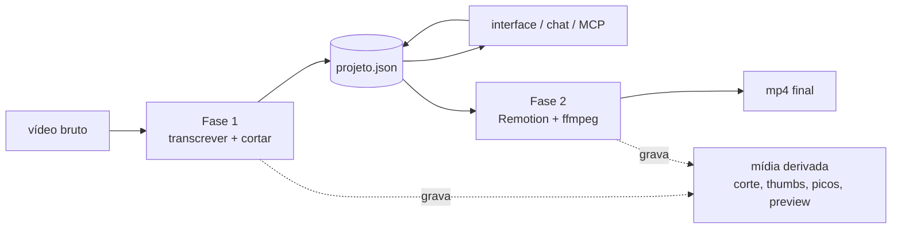
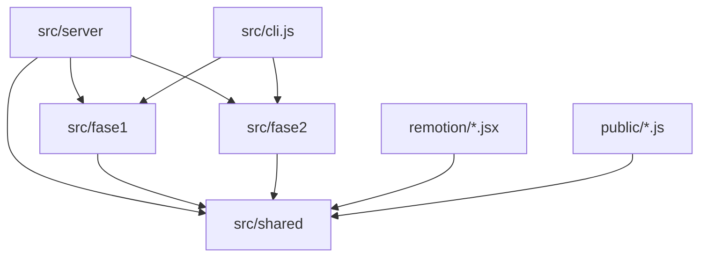
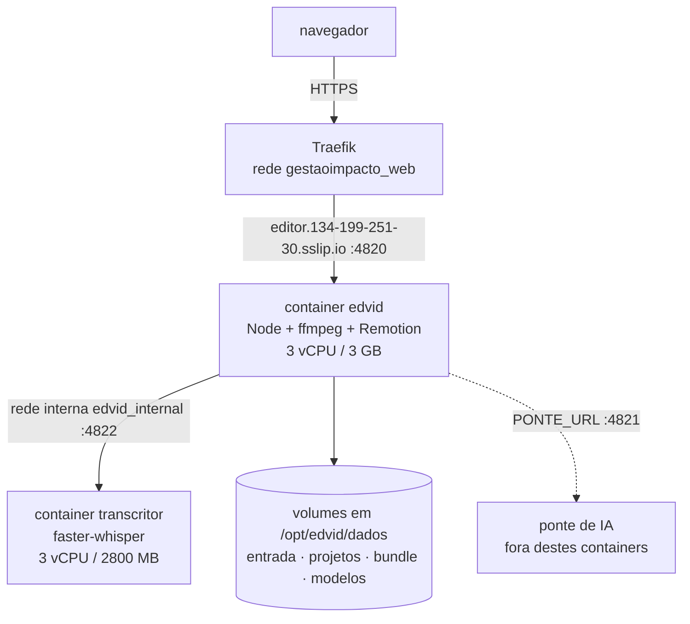

# Architecture Spine — edvid

## Design Paradigm

**Pipeline por fases sobre um documento-estado, com fila serial.**

Cada fase é um filtro que lê o vídeo bruto e o `projeto.json`, produz mídia nova ao lado dele e devolve o `projeto.json` atualizado. Nenhuma fase fala com outra diretamente: elas se encontram no documento. Trabalho pesado só anda por uma fila serial de um item por vez.

| Camada | Diretório | Papel |
| --- | --- | --- |
| Motores puros | `src/shared/` | Cálculo e utilidades sem estado de projeto: corte de cor, motor de legenda, presets, efeitos, wrappers de processo |
| Fases | `src/fase1/`, `src/fase2/` | Os filtros do pipeline; leem e escrevem `projeto.json` e mídia |
| Transporte | `src/server/` | HTTP, WebSocket, MCP, fila, upload, chat |
| Apresentação | `remotion/` | Composição React que desenha o vídeo final a partir do `projeto.json` |
| Interface | `public/` | A tela que o Gabriel usa |
| Entrada de linha de comando | `src/cli.js` | Mesmo pipeline sem servidor |



## Invariants & Rules

### AD-1 — `projeto.json` é a única fonte de verdade editável

- **Binds:** todas as fases, as 39 rotas HTTP, as 19 ferramentas MCP, a composição Remotion
- **Prevents:** dois lugares guardando a mesma decisão de edição e divergindo — a tela mostrando um corte e o render produzindo outro
- **Rule:** toda decisão de edição (clipes ativos, cor, legenda, intro, efeitos, estilo) mora em `projeto.json` (`src/fase1/projeto.js:12`). Mídia ao lado dele é **derivada**: apagável e regerável a qualquer momento. Nada que não se possa reconstruir do documento pode existir só como arquivo.

### AD-2 — Trabalho pesado só anda pela fila serial

- **Binds:** Fase 1, Fase 2, refazer corte, upload que termina, varredura de pasta
- **Prevents:** dois whisper ou dois Remotion competindo pela CPU e ficando, somados, mais lentos que se tivessem rodado em sequência
- **Rule:** transcrição, corte e render entram por `fila.enfileirar(tipo, dados)` e nunca são chamados direto de uma rota. Um item por vez, sem exceção e sem paralelismo configurável. Quem quiser saber o andamento escuta o evento, não o processo.

### AD-3 — A fila sobrevive ao reinício

- **Binds:** `src/server/fila.js`, o boot do servidor
- **Prevents:** perder trabalho enfileirado quando o container reinicia por deploy ou por OOM
- **Rule:** a fila persiste `{ fila, atual }` em disco a cada mudança, com escrita atômica (`.tmp` + rename). No boot o item que estava rodando volta **na frente** da fila, marcado como retomado. Quem monta o servidor decide quando puxar, chamando `retomar()` depois de registrar executores e listeners — o construtor nunca dispara trabalho sozinho.

### AD-4 — A composição Remotion só lê; nunca age

- **Binds:** os 7 arquivos de `remotion/`
- **Prevents:** o preview mostrar uma coisa e o render final produzir outra
- **Rule:** nenhum componente de `remotion/` faz I/O de arquivo, chama ffmpeg, ou lê configuração de ambiente. Recebe `projeto` por `inputProps` e desenha. Qualquer cálculo que a tela e o render precisem compartilhar mora em `src/shared/` e é importado pelos dois lados — é por isso que `presets.js` e `legenda-motor.js` são servidos ao navegador em `/shared`.

### AD-5 — Direção de dependência: `shared` não conhece ninguém acima

- **Binds:** todo o `src/`
- **Prevents:** ciclos de importação, e regra de negócio vazando para dentro dos motores até que não se possa mais testá-los isolados
- **Rule:** `shared` não importa de `fase1`, `fase2` nem `server`. As fases não importam de `server`. O `server` importa de todos.



### AD-6 — Decisão de ambiente mora no ambiente

- **Binds:** `src/shared/config.js`, `docker-compose.yml`, `Dockerfile`
- **Prevents:** o código encher de `if (estouNaVPS)` e passar a mentir sobre onde roda
- **Rule:** onde Mac e VPS precisam de valores diferentes, o **código** traz o default de quem desenvolve e o **compose** sobrescreve para produção. O precedente vivo é `REMOTION_CONCURRENCY: "3"` no `docker-compose.yml`: o `os.cpus()` do Node lê os núcleos do **host**, não o limite de cgroup do container, então nenhum default automático no código serve a VPS — só o ambiente sabe. A única exceção aceita é `CODEC`, que ramifica por `process.platform`, porque aceleração de hardware é propriedade da máquina e não da implantação.
- **Corolário:** quando a medição derruba o plano, o comentário tem que cair junto. `EDVID_GL=swangle` foi planejado e argumentado em comentário nos dois arquivos, mas a medição (`4ba3cbe`: 157/117/97 s, swangle empatado com o padrão) mandou ficar no padrão — e a variável nunca entrou no compose. Os comentários em `docker-compose.yml:40-43` e `src/shared/config.js:60-75` ainda descrevem o plano abandonado como se fosse o estado atual.

### AD-7 — Nenhuma rota depende de uma requisição longa

- **Binds:** upload, render, transcrição, qualquer rota nova que mexa com arquivo grande
- **Prevents:** 502 no navegador quando o Traefik corta a requisição parada aos 60 segundos
- **Rule:** o proxy da VPS tem `readTimeout` de 60s. Vídeo grande sobe fatiado, uma requisição curta por pedaço (`POST /api/upload/iniciar` → `PUT /api/upload/:id/:indice` → `POST /api/upload/:id/finalizar`). Trabalho demorado responde na hora com um item de fila e informa o andamento por WebSocket. O `headersTimeout` e o `keepAliveTimeout` do Node ficam em 65s, **acima** dos 60 do Traefik de propósito: quem corta é o proxy, um corte só.

### AD-8 — Corpo binário se declara explicitamente nas duas pontas

- **Binds:** `PUT /api/upload/:id/:indice` e qualquer rota futura que receba binário cru
- **Prevents:** o parser ser pulado em silêncio e o corpo chegar `undefined`, com o erro aparecendo a três camadas de distância como "rede caiu"
- **Rule:** rota de binário usa `express.raw({ type: () => true })`, nunca o curinga em string — `Blob.slice()` no navegador não herda o tipo do arquivo, e o `type-is` responde `false` quando não há cabeçalho de tipo. O cliente manda `Content-Type` explícito mesmo assim. O handler valida que recebeu um Buffer não vazio antes de escrever, e recusa com recado legível.

### AD-9 — O que é caro e determinístico é cacheado por hash

- **Binds:** preview de cor, bundle do Remotion, cache de legenda, preview de vídeo
- **Prevents:** refazer segundos ou minutos de trabalho idêntico a cada abertura de tela
- **Rule:** resultado caro que depende só de entradas conhecidas é gravado em disco sob um nome derivado do hash dessas entradas, e a URL que o serve carrega `?v=` para o navegador poder cachear com folga. Cache é sempre descartável: apagar a pasta só custa tempo, nunca dado.

## Consistency Conventions

| Concern | Convention |
| --- | --- |
| Idioma | Código, comentários, mensagens de erro, rotas e nomes de campo em português. Comentário explica **por que**, não o que; se não explica uma decisão, não deve existir. |
| Nomes | Arquivos e funções em português sem acento (`fase1`, `refazerCorte`, `enfileirar`). Campos de JSON com acento quando for texto para humano. |
| Módulos | ESM (`"type": "module"`), `async/await`, sem classes fora da fila. |
| Tempo | Segundos como número em `projeto.json` e nas configurações; milissegundos só na fronteira com APIs do Node (timeouts). Datas em ISO 8601. |
| Erros | Fase e rota lançam `Error` com mensagem em português dirigida a quem vai ler na tela. Rota traduz para `{ erro: mensagem }` com status; nunca vaza mensagem crua de biblioteca. |
| Escrita em disco | Estado importante grava em `.tmp` e renomeia. Nunca escrita parcial visível. |
| Progresso | Fase reporta por callback `log({ etapa, msg, pct })`; a fila repassa por WebSocket. Fase não conhece WebSocket. |
| Configuração | Toda env nova entra em `src/shared/config.js` com default que funcione no Mac do Gabriel sem configurar nada. |
| Testes | `node --test`, um `.test.js` ao lado do módulo. Teste novo tem que falhar contra o código antigo antes de valer. Teste que sobe servidor fecha no `finally`. |

## Stack

| Name | Version |
| --- | --- |
| Node.js | 22 |
| Express | 5.2 |
| Remotion (`@remotion/bundler`, `renderer`, `cli`) | 4.0.520 |
| React / React DOM | 19.2 |
| ws | 8.21 |
| multer | 2.3 |
| zod | 4.5 |
| `@modelcontextprotocol/sdk` | 1.30 |
| chokidar | 5.0 |
| whisper.cpp | 1.9.3 (compilado no Dockerfile, sem CUDA) |
| faster-whisper | large-v3-turbo |
| ffmpeg / ffprobe | do sistema |
| Docker Compose + Traefik | rede `gestaoimpacto_web` |

## Structural Seed

```text
gab-edvid/
  src/
    cli.js             # mesmo pipeline sem servidor
    shared/            # motores puros: config, exec, cor, presets, efeitos, legenda, preview
    fase1/             # probe, wav, transcricao, corte organico, render do corte
    fase2/             # bundle e render do Remotion
    server/            # express, ws, fila, upload, mcp, ferramentas, cerebro, comandos
  remotion/            # Reel, Legenda, Intro, Transicao, Efeitos, Root
  public/              # interface (index.html, app.js, cor.js, legenda-editor.js)
  transcritor/         # sidecar Python faster-whisper (container proprio)
  deploy/              # subir.sh e o passo a passo da VPS
  docs/planejamento/   # este documento
```

### Envelope operacional

Dois containers numa VPS, atrás do Traefik do gestaoimpacto:



- O `transcritor` **não** é publicado: só o `edvid` o alcança, pela rede interna.
- O estado inteiro do sistema são os volumes em `/opt/edvid/dados`. Não há banco.
- O deploy é `rsync` + `docker compose up -d --build`, por `deploy/subir.sh`.
- `EDVID_GL` **não** é definido: o render roda no GL padrão do Chromium, por medição, não por esquecimento.
- `sslip.io` resolve o IP no próprio nome, então o TLS do Let's Encrypt funciona sem DNS próprio. `[ASSUMPTION]` isso parece ser provisório até haver domínio de verdade.

## Deferred

| Deixado para depois | Por que pode esperar |
| --- | --- |
| Banco de dados | O estado cabe em JSON por projeto e a leitura é sempre por nome. Um banco só se passar a existir consulta que cruze projetos. |
| Autenticação e multiusuário | Hoje é uma pessoa numa URL não divulgada. Vira decisão de verdade no dia em que houver a segunda pessoa — e aí muda AD-1, porque `projeto.json` passa a ter dono. |
| Escala horizontal | A fila é serial **e por processo**: dois containers do `edvid` sobre os mesmos volumes brigariam pelo `fila.json`. Enquanto for uma máquina, AD-2 basta. |
| Limpeza de mídia derivada | Nada apaga render antigo. Só importa quando o disco da VPS apertar. |
| Retentativa automática de item que falhou | Hoje o erro fica visível na fila e a pessoa decide. `[ASSUMPTION]` deliberado: render caro não deve repetir sozinho. |
